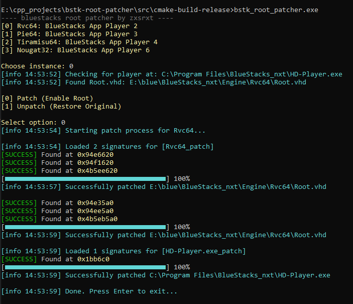

# bstk-root-patcher
Bluestacks adb root gain



# Disclaimer
Note on Originality: This project was first researched and developed by zxsrxt and shared in Telegram. If you see similar logic or identical signatures in other repositories, they are likely derived from decompiling my early builds. This repository contains the original source and the logic behind the discovery.


# Writeup

after bluestacks update > 5.22.130 developers closed ability to gain userspace-root via /system/xbin/bstk/su.
i took su binary(/system/xbin/bstk/su),
pulled it via adb and open in ida pro.
they added 2much checks for uid, developer mode, crc32 
and more. for now it loads uid whitelist from array and checks executor uid for presence it in list
``` char __fastcall uid_in_whitelist(int a1) ```

also developer mode is some flag in host system that allows modifying android system directly.

so i need a way to patch it automatically.
we cant upload directly to android because of /system mounted as ro(read-only)

i generated 2 sigs and patched it(mov eax, 1; ret;) in Root.vhd in $(DataDir)/Pie64/.
firstly i tried to write a ext4 filesystem parser via lwext4 lib,
but it cant parse due to some android and bstk restrictions

so i wrote direct file scanner+patcher and it works!!

after few tests and +- an hour, bluestacks crc32 check was enabled and triggers a security shutdown

since it appears after Android has fully loaded, i thought it was in HD-Player.exe, and i was right.
i reversed .exe, and found this 
``` c++
QObject::tr(
      v21,
      "The Android system will be shut down because it has been illegally tampered with and does not meet security requirements!",
      0,
      0xFFFFFFFFLL);
```

so in this function was this check

``` c
if ( (unsigned __int8)sub_1401BC2C0() )
    {
      v1 = (unsigned int (__fastcall **)(_QWORD, __int64))sub_140516AD0();
      if ( (*v1)((unsigned int)dword_14199F41C, 2) )
      {
        v2 = sub_140516AD0();
        (*(void (__fastcall **)(__int64, _QWORD, const char *, const char *, int, const char *))(v2 + 8))(
          2,
          (unsigned int)dword_14199F41C,
          "C:\\code\\app-player\\hd\\Source\\plr\\PlrMain.cpp",
          "plrDiskCheckThreadEntry",
          1026,
          "Verified the disk integrity!");
      }
      v0 = 1;
      v17 = 1;
    }
    else
    {
      v3 = (unsigned int (__fastcall **)(_QWORD, _QWORD))sub_140516AD0();
      if ( (*v3)((unsigned int)dword_14199F41C, 0) )
      {
        v4 = sub_140516AD0();
        (*(void (__fastcall **)(_QWORD, _QWORD, const char *, const char *, int, const char *))(v4 + 8))(
          0,
          (unsigned int)dword_14199F41C,
          "C:\\code\\app-player\\hd\\Source\\plr\\PlrMain.cpp",
          "plrDiskCheckThreadEntry",
          1029,
          "Failed to verify the disk integrity!");
      }
    }

```

so i patched sub_1401BC2C0 to return true(mov al, 1; ret;)

and... it works! i dont get this restriction now

## upd 1

after testing Pie64, i decided to look into android 11 (Rvc64) and android 13 (Tiramisu64).
i noticed a huge difference: in Pie64 `su` was statically linked (1.2MB), but in Rvc64 it's dynamically linked and weighs only 40KB! 

i could write new signatures for `uid_in_whitelist` for each android version, but i found something much better in the execution flow.
if `uid_in_whitelist` returns false, the binary falls back to checking developer mode:

```c
  v64 = isDeveloperMode();
  warnx("DEBUG: Hcall wrapper function returned: %d", v96[0]);a
  if ( !v64 ) 
  {
      report_su_denied(...);
      return 1; 
  }
  // ... grants root if v64 == 1
```

the `isDeveloperMode()` function acts as an Hcall (Hypercall) wrapper that asks the windows host if root is enabled in emulator settings.
if we patch THIS function to return true (`mov al, 1; ret;`), the emulator grants root access universally.

the holy grail? the compiler generated the **exact same assembly** for this wrapper across Android 9, 11, and 13 (x64)!
so one signature rules them all:
`53 48 8D 3D ? ? ? ? 31 C0 E8 ? ? ? ? 48 8D 3D ? ? ? ? BE ? ? ? ? E8 ? ? ? ? 85 C0 78 ? 89 C7` -> `B8 01 00 00 00 C3`

i also reversed the 32-bit x86 `su` for Nougat32 and added support for it.

